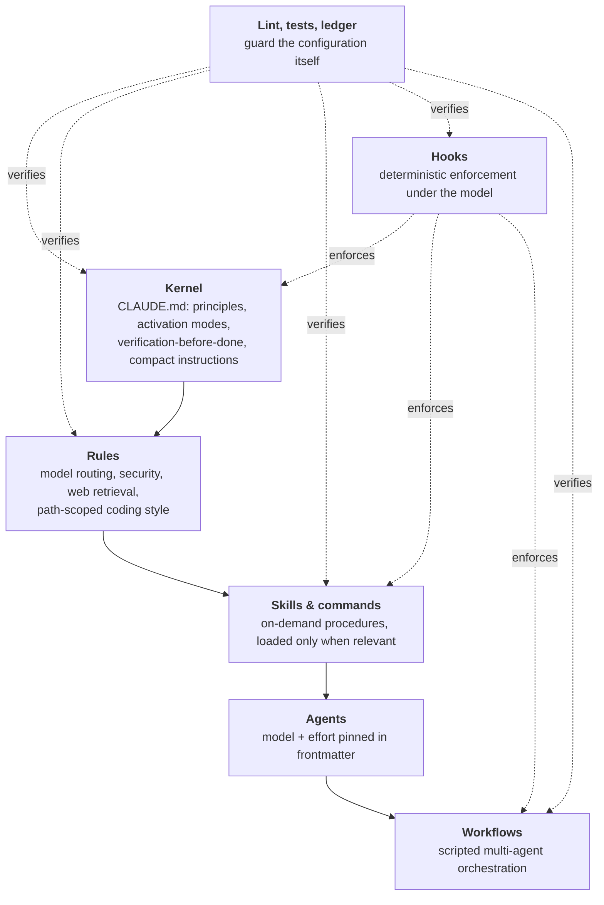

# How I run Claude Code

This repo is a sample. The system it comes from is my private `~/.claude`: a versioned,
linted and tested configuration that I use daily for long, mostly unattended builds. This
page describes that whole system. The pieces published here are marked **[published]**.

Snapshot as of October 2026: 304 commits since 2026-09-11, 16 hook scripts wired as 28
handlers across 6 hook events, 28 fixture test files, 55 skills, 4 pinned agents, 3
multi-agent workflows, 8 commands, 4 rule files.

## The layers

Each layer answers a different question:

| Layer | Question | Design rule |
|---|---|---|
| **Kernel** (`CLAUDE.md`) | How do we work, always? | Kept small: the always-on context has a hard budget of 10,000 bytes, enforced by lint. It routes to detail instead of holding it. |
| **Rules** | What policy applies here? | One canonical source per rule. Language-specific rules load only for matching file paths. |
| **Skills & commands** | How is this kind of task done well? | Loaded on demand (progressive disclosure), so 55 skills cost almost nothing until used. A run sheet stays under 200 lines. |
| **Agents** | Who does this step, on which model? | Model and effort are pinned, never inherited (see [model-routing](rules/model-routing/) **[published]**). |
| **Workflows** | How do many agents cooperate? | Every agent call pins its model, and every fan-out declares a width. Both are enforced by a hook (**[published]** as [workflow-lint](hooks/workflow-lint/)). |
| **Hooks** | What must happen every time? | Anything that must never be skipped becomes a hook. Every hook fails open on its own errors. |
| **Lint, tests, ledger** | Is the system itself healthy, and is it working? | The configuration is code: it has fixtures, a linter and a gate that blocks syncing a broken config. |

## Hooks: the enforcement layer

| Event | What runs |
|---|---|
| `PreToolUse` | protected files **[published]** · chain-aware commit secret gate **[published]** · a delete guard that asks before any `rm`, `find -delete` or `git clean` on project folders · workflow lint **[published]** · a large-file read redirect, run as an A/B pilot |
| `PostToolUse` | formatter · a "dirty" marker that defers typechecking to the end of the turn · a per-edit design lint for the most common AI-generated-UI tells · file-size check |
| `UserPromptSubmit` | context nudge **[published]** · a router that sends build and design prompts to the right skill |
| `SessionStart` | config sync · loads project state and the build handoff file, capped at 4 KB |
| `Stop` | verify gate **[published]** · typecheck gate (shares the same stop-gate library) · session log · config push |
| `Notification` | a native desktop notification when Claude needs input |

Two principles run through all of them:

- **Defer expensive checks to a boundary.** Edits only mark the project dirty; the typecheck
  and the verify suite run once, when the agent tries to stop. That costs one check per
  turn instead of one per edit.
- **Never trap the session.** Every Stop-gate releases on timeout and after three identical
  failures, and scopes out pre-existing errors ([verify-gate](hooks/verify-gate/) explains why
  Claude Code's own cap isn't enough).

## Multi-agent workflows

Three scripted workflows, each built so that the author never grades its own work:

- **Deep research.** Several search angles fan out, then sources are fetched and every
  claim goes through adversarial verification (it must survive independent refutation
  attempts), and finally a cited report is written. Cheap models search and extract; a
  strong model judges.
- **Design directions.** Two or three competing directions are written in parallel. One is
  always the house base for that kind of business, adapted to the client; the others come
  from curated references, premium templates or the field. They go through a kill-check
  for generic "AI-looking" choices and a viability screen, and then a human picks on the
  rendered result, because a model asked to pick its own favorite tends to take the safest
  card. A random draw decides only when the run is unattended.
- **UI round.** Workers build screens, then a fresh-context judge on Opus at max effort reviews
  only the final screenshots, and only the defects get fixed and re-judged. Concurrency is capped.

The review gates use **a different model from the author**. A reviewer that inherits the
author's model inherits a version of the author's judgment.

## Measuring the system

`cc-ledger.py` is a read-only analytics tool (about 1,900 lines) over Claude Code session
transcripts. It isn't published, because it reads private transcripts. It reports:

- **Where context goes:** tokens by model, main thread vs subagents, and the share taken by tool output.
- **Routing drift:** agent runs that ran on a different model than their pin, and why (it was always an explicit override, never the pin failing).
- **Effort:** the effort level per model, per call.
- **Done-claims vs verification:** how often the agent said "done" against how often a check actually ran, and how often a Stop-gate blocked.

Changes are made against a measurement, then re-measured. Two examples. The
[context nudge](hooks/context-nudge/) exists because the ledger showed most main-thread
input coming from calls above 400k context. The workflow model-pin lint targets the
ledger's other finding: agents with no pinned model inherited the session model, which
accounted for most workflow tokens.

## Guarding the configuration itself

These linters aren't published, because they check paths and conventions specific to
this configuration. The patterns transfer.

- **`config-lint`**, 11 deterministic sections:
  - every referenced path exists;
  - one canonical source per fact;
  - no expired "until <date>" notes;
  - stated counts match the directories;
  - every hook target exists and parses;
  - hook and stop-gate fixtures pass;
  - the always-on context stays inside budget.

  The cross-machine sync pushes only when the deterministic FAIL count is zero.
- **`skill-lint`** checks:
  - frontmatter, and that `name` matches the directory;
  - description quality;
  - dead and orphan references, and size limits;
  - supply-chain red flags in third-party skills: hidden or bidirectional Unicode, HTML comments, base64 blobs, prompt-injection phrases, `curl | sh`, token-shaped strings.
- **Fixtures**: 28 test files across shell, Python and JavaScript. Multi-agent workflows are
  dry-run with stubbed agents in a sandboxed `HOME`.

## Working method

The [five-gates](skills/five-gates/) skill **[published]** is the always-on discipline:
Scope → Evidence → Attack → Verify → Report. Work is sized into three modes: *Micro* (just
do it), *Sprint* (plan, dev↔QA loop, review gate) and *Full* (discovery, design, dev↔QA,
fresh-context review). Long runs checkpoint to a plan file, so a compacted or interrupted
session resumes without re-deriving state. After any correction, the lesson is recorded and
read at the next session start.
