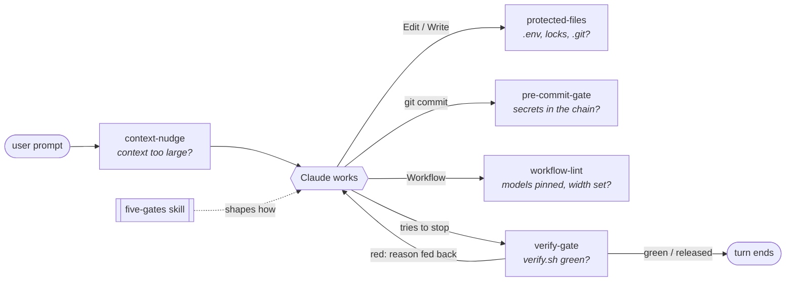

# claude-code-toolkit

[](https://github.com/pedrozapatadev/claude-code-toolkit/actions/workflows/test.yml)
[](LICENSE)

**Deterministic guardrails for Claude Code, built around one rule: an agent's "done"
has to be proven, not claimed.**

This is a curated extract from the configuration I use every day to run Claude Code on
long, mostly unattended builds. It has five hooks, one script, one skill and one rule.
Each piece is self-contained, has its own README explaining the design, and is covered
by fixture tests that run in CI on Linux and macOS.

**[ARCHITECTURE.md](ARCHITECTURE.md)** describes the whole system these pieces come from:
its layers, the multi-agent workflows, how I measure it, and how the configuration
tests itself.

| Piece | Type | What it does | Tests |
|---|---|---|---|
| [**verify-gate**](hooks/verify-gate/) | `Stop` hook | Blocks the agent from ending its turn on a broken build, re-verifies its fix, and releases on bounded conditions so a session can't get stuck. | 39 |
| [**commit-guard**](hooks/commit-guard/) | `PreToolUse` hooks | Blocks commits that would include secrets or credential files, including through chained commands like `git add .env && git commit`. Guards `.env`, lock files and `.git/` from edits, and asks before edits to the gate's own `verify.sh`. | 90 |
| [**workflow-lint**](hooks/workflow-lint/) | `PreToolUse` hook | Lints multi-agent workflow scripts before they run: every `agent()` call must pin its model, and every fan-out must declare its width. | 58 |
| [**context-nudge**](hooks/context-nudge/) | `UserPromptSubmit` hook | Tells the model, once, at a prompt boundary, when the context is large enough that a fresh session would be cheaper and sharper. | 10 |
| [**stub-grep**](scripts/stub-grep/) | script | Fails on `TODO` / `FIXME` / `not implemented` in *added* lines only, so placeholder "finished" code can't slip through. | 12 |
| [**five-gates**](skills/five-gates/) | skill | A working discipline: Scope, Evidence, Attack, Verify, Report. The prompt-side twin of the hooks. | n/a |
| [**model-routing**](rules/model-routing/) | rule | Which model tier and effort level runs which kind of step, and how to keep routing from silently breaking. | n/a |

## How the pieces fit



Hooks enforce the parts that must never be skipped. The skill shapes the judgment that
hooks can't reach. The [Claude Code best practices](https://code.claude.com/docs/en/best-practices)
draw the same line: `CLAUDE.md` instructions are advisory, hooks are deterministic.

## Design principles

1. **Deterministic over advisory.** If skipping a step is expensive, it is a hook, not a
   sentence in a prompt.
2. **Block only when the block is useful.** A guardrail that loops forever, hangs on a slow
   build, or blames the agent for pre-existing errors gets switched off soon enough.
   verify-gate releases on timeout, after three identical failures and after five blocks
   in one turn, and it scopes out errors in files the agent didn't touch. Claude Code's built-in cap (8 consecutive
   Stop-hook continuations) resets whenever Claude calls a tool, so an agent that keeps
   attempting fixes never reaches it. The release has to live in the hook.
3. **Fail open on the unparseable, closed on the known-dangerous.** When a hook can't
   parse its input, it allows the action, so an exotic command doesn't wedge a session.
   A recognized secret pattern or credential path blocks. The trade-off is spelled out in
   [SECURITY.md](SECURITY.md).
4. **Model the agent, not a human.** Agents chain commands, commit from other
   directories and never pause between `add` and `commit`. commit-guard parses the whole
   command line because a git `pre-commit` hook sees an empty index at that moment.
5. **Every piece has failable tests.** Sandboxed `HOME`, temporary git repos, no network.
6. **Reviewed by a different model before release.** A fresh-context review on another
   model found five major bugs in the first cut: the gate checked only once per turn,
   files in new folders were invisible to it, the commit gate could be bypassed (`git add -f`,
   `bash -c`, large commits), and the gate's own `verify.sh` was editable. Each is fixed
   and has a regression test ([CHANGELOG](CHANGELOG.md)).

## Install

As a Claude Code plugin (installs the hooks and the skill):

```text
/plugin marketplace add pedrozapatadev/claude-code-toolkit
/plugin install verify-first@pedrozapatadev
```

Then opt a repo into the verification gate by copying the template:

```bash
mkdir -p .claude && curl -fsSL https://raw.githubusercontent.com/pedrozapatadev/claude-code-toolkit/main/hooks/verify-gate/verify.sh -o .claude/verify.sh
```

Or pick pieces by hand: clone to `~/.claude/toolkit` and merge the entries you want from
[`settings.example.json`](settings.example.json) into `~/.claude/settings.json`. The rule
is plain Markdown; see [its README](rules/model-routing/).

> Hooks run shell commands with your permissions. Read them before enabling them. They
> are short and commented for that reason.

Requirements: `bash` 3.2+, `git`, `jq`, `perl`, `python3`. All ship with current macOS
(jq since macOS 15); on Linux, install `jq` if it's missing. Developed against Claude Code
2.1.284. Windows is untested; use WSL.

**Uninstall:** `/plugin uninstall verify-first@pedrozapatadev`, then optionally remove the
state the hooks keep: `~/.claude/state/stop-gate/`, `~/.claude/state/stop-gate.log`,
`~/.claude/state/workflow-lint.jsonl` and `~/.claude/hooks/state/context-nudge/`.

## Limits

These are guardrails for a cooperative agent working fast. They are not a sandbox against a
hostile one. Hooks see tool calls, not intent: a Bash redirect bypasses the Edit/Write
guard, and the secret gate recognizes three high-signal key formats, not every
credential. Each piece's README lists its own limits.

## Tests

```bash
./run-tests.sh
```

```text
hooks/commit-guard/test.sh       commit-guard: 90 passed
hooks/context-nudge/test.sh      context-nudge: 10 passed, 0 failed
hooks/verify-gate/test.sh        verify-gate: 39 passed, 0 failed
hooks/workflow-lint/test.sh      workflow-lint: 58 passed, 0 failed
scripts/stub-grep/test.sh        stub-grep: 12 passed, 0 failed
```

## Background reading

- [Best practices for Claude Code](https://code.claude.com/docs/en/best-practices): give Claude a way to verify its work, and use hooks for anything that must happen every time.
- [Hooks reference](https://code.claude.com/docs/en/hooks): the event and JSON contracts these hooks implement.
- [Effective context engineering for AI agents](https://www.anthropic.com/engineering/effective-context-engineering-for-ai-agents): context as a finite resource, the premise of context-nudge.
- [Equipping agents for the real world with Agent Skills](https://www.anthropic.com/engineering/equipping-agents-for-the-real-world-with-agent-skills): the skill format five-gates uses.

## About

I'm Pedro Zapata Medal. I build with coding agents daily and treat the harness around the
model as the real engineering surface: what gets verified, what gets blocked, which model
runs which step. Everything here was extracted from my working setup, generalized,
and given tests before publishing.

MIT licensed.
